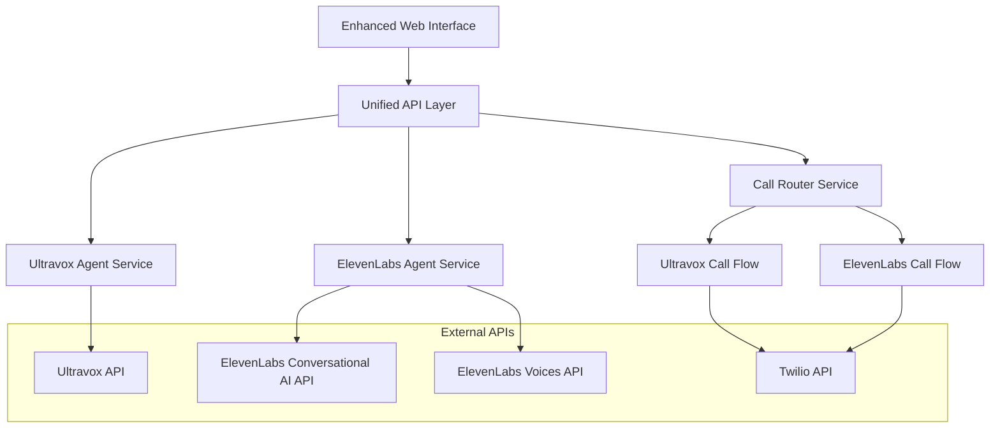
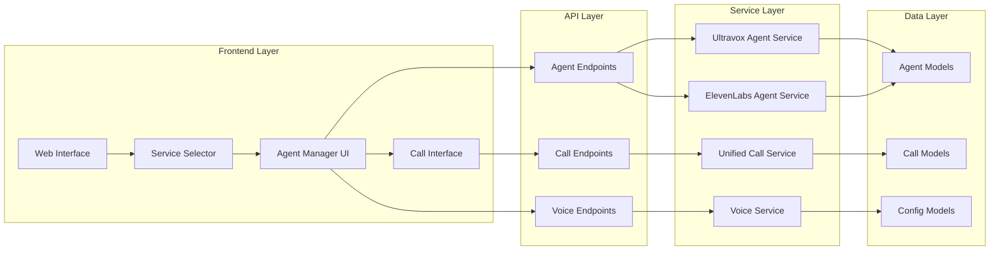

# Design Document - ElevenLabs Conversational AI Integration

## Overview

This design document outlines the architecture and implementation approach for integrating ElevenLabs Conversational AI as a replacement for the current ElevenLabs Voice Message functionality. The solution will provide users with two conversational AI options: Ultravox AI agents and ElevenLabs Conversational AI agents.

## Architecture

### High-Level Architecture



### Component Architecture



## Components and Interfaces

### 1. Enhanced Web Interface

**Purpose**: Provide unified interface for both Ultravox and ElevenLabs conversational AI agents.

**Key Changes**:
- Replace "Voice Message" option with "ElevenLabs AI Agent"
- Add agent creation form for ElevenLabs with voice selection
- Integrate voice preview functionality into agent creation
- Maintain existing Ultravox agent functionality

**Interface Elements**:
```html
<!-- Service Selection -->
<div class="service-selection">
    <div class="service-option" data-service="ultravox">
        <h3>Ultravox AI Agent</h3>
        <p>Advanced conversational AI with streaming capabilities</p>
    </div>
    <div class="service-option" data-service="elevenlabs">
        <h3>ElevenLabs AI Agent</h3>
        <p>Conversational AI with premium voice synthesis</p>
    </div>
</div>

<!-- ElevenLabs Agent Creation -->
<div id="elevenlabs-agent-section">
    <input type="text" id="elevenLabsAgentName" placeholder="Agent Name">
    <textarea id="elevenLabsAgentPrompt" placeholder="System Prompt"></textarea>
    <select id="elevenLabsVoiceSelect">
        <!-- Populated dynamically -->
    </select>
    <button id="previewElevenLabsVoice">Preview Voice</button>
    <button id="createElevenLabsAgent">Create Agent</button>
</div>
```

### 2. ElevenLabs Agent Service

**Purpose**: Manage ElevenLabs Conversational AI agents with full CRUD operations.

**Class Structure**:
```python
class ElevenLabsAgentService:
    def __init__(self, config: ElevenLabsConfig, http_client: HTTPClient):
        self.config = config
        self.http_client = http_client
        self._agent_cache = {}
    
    async def create_agent(self, agent_config: ElevenLabsAgentConfig) -> ElevenLabsAgent:
        """Create a new ElevenLabs conversational agent."""
        
    async def list_agents(self) -> List[ElevenLabsAgent]:
        """List all ElevenLabs agents with caching."""
        
    async def get_agent(self, agent_id: str) -> ElevenLabsAgent:
        """Get specific agent details."""
        
    async def update_agent(self, agent_id: str, config: ElevenLabsAgentConfig) -> ElevenLabsAgent:
        """Update agent configuration."""
        
    async def delete_agent(self, agent_id: str) -> bool:
        """Delete an agent and cleanup resources."""
```

**API Integration**:
- **POST /v1/convai/agents** - Create agent
- **GET /v1/convai/agents** - List agents
- **GET /v1/convai/agents/{agent_id}** - Get agent
- **PUT /v1/convai/agents/{agent_id}** - Update agent
- **DELETE /v1/convai/agents/{agent_id}** - Delete agent

### 3. ElevenLabs Conversation Service

**Purpose**: Manage ElevenLabs conversations and phone call integration.

**Class Structure**:
```python
class ElevenLabsConversationService:
    def __init__(self, config: ElevenLabsConfig, http_client: HTTPClient):
        self.config = config
        self.http_client = http_client
    
    async def create_conversation(self, agent_id: str) -> ElevenLabsConversation:
        """Create a new conversation with an agent."""
        
    async def start_phone_call(self, conversation_id: str, phone_number: str) -> CallResult:
        """Start a phone conversation."""
        
    async def get_conversation_status(self, conversation_id: str) -> ConversationStatus:
        """Get current conversation status."""
        
    async def end_conversation(self, conversation_id: str) -> bool:
        """End conversation and cleanup resources."""
```

**API Integration**:
- **POST /v1/convai/conversations** - Create conversation
- **POST /v1/convai/conversations/{id}/phone** - Start phone call
- **GET /v1/convai/conversations/{id}** - Get status
- **DELETE /v1/convai/conversations/{id}** - End conversation

### 4. Unified Call Service Enhancement

**Purpose**: Route calls between Ultravox and ElevenLabs based on agent type.

**Enhanced Methods**:
```python
class UnifiedCallService:
    async def initiate_call(self, agent_id: str, phone_number: str, agent_type: str) -> CallResult:
        """Route call based on agent type."""
        if agent_type == "ultravox":
            return await self._initiate_ultravox_call(agent_id, phone_number)
        elif agent_type == "elevenlabs":
            return await self._initiate_elevenlabs_call(agent_id, phone_number)
        else:
            raise ValueError(f"Unknown agent type: {agent_type}")
    
    async def _initiate_elevenlabs_call(self, agent_id: str, phone_number: str) -> CallResult:
        """Handle ElevenLabs conversational call flow."""
        # 1. Create conversation
        conversation = await self.elevenlabs_conversation_service.create_conversation(agent_id)
        
        # 2. Start phone call
        call_result = await self.elevenlabs_conversation_service.start_phone_call(
            conversation.id, phone_number
        )
        
        # 3. Track call for monitoring
        self._register_call(call_result.call_sid, "elevenlabs", conversation.id)
        
        return call_result
```

### 5. Data Models

**ElevenLabs Agent Model**:
```python
@dataclass
class ElevenLabsAgentConfig:
    name: str
    system_prompt: str
    voice_id: str
    conversation_config: Optional[Dict[str, Any]] = None
    
    def validate(self) -> bool:
        """Validate agent configuration."""
        return (
            len(self.name.strip()) > 0 and
            len(self.system_prompt.strip()) > 0 and
            len(self.voice_id.strip()) > 0
        )

@dataclass
class ElevenLabsAgent:
    id: str
    config: ElevenLabsAgentConfig
    created_at: datetime
    updated_at: Optional[datetime] = None
    status: str = "active"
    
    @property
    def agent_type(self) -> str:
        return "elevenlabs"
```

**Unified Agent Model**:
```python
@dataclass
class UnifiedAgent:
    id: str
    name: str
    agent_type: str  # "ultravox" or "elevenlabs"
    config: Union[AgentConfig, ElevenLabsAgentConfig]
    created_at: datetime
    status: str = "active"
    
    @classmethod
    def from_ultravox_agent(cls, agent: Agent) -> 'UnifiedAgent':
        """Convert Ultravox agent to unified format."""
        
    @classmethod
    def from_elevenlabs_agent(cls, agent: ElevenLabsAgent) -> 'UnifiedAgent':
        """Convert ElevenLabs agent to unified format."""
```

## Data Models

### Agent Configuration Models

```python
# ElevenLabs specific models
class ElevenLabsConversationConfig:
    turn_detection: Optional[Dict[str, Any]] = None
    agent_tools: Optional[List[Dict[str, Any]]] = None
    language: str = "en"
    max_duration_seconds: int = 1800  # 30 minutes
    
class ElevenLabsAgentConfig:
    name: str
    system_prompt: str
    voice_id: str
    conversation_config: ElevenLabsConversationConfig
    
# Unified models for API responses
class UnifiedAgentResponse:
    id: str
    name: str
    agent_type: str
    voice_info: Optional[Dict[str, str]]  # For ElevenLabs agents
    created_at: str
    status: str
```

### Call Models

```python
class ElevenLabsCallResult(CallResult):
    conversation_id: str
    agent_id: str
    voice_id: str
    
    @property
    def call_type(self) -> str:
        return "elevenlabs_conversational"
```

## Error Handling

### Error Categories

1. **Agent Management Errors**:
   - `ElevenLabsAgentNotFoundError`
   - `ElevenLabsAgentValidationError`
   - `ElevenLabsAgentCreationError`

2. **Conversation Errors**:
   - `ConversationCreationError`
   - `ConversationNotFoundError`
   - `PhoneCallInitiationError`

3. **API Integration Errors**:
   - `ElevenLabsAPIError`
   - `ElevenLabsQuotaExceededError`
   - `ElevenLabsAuthenticationError`

### Error Handling Strategy

```python
class ElevenLabsErrorHandler:
    @staticmethod
    def handle_api_error(error: HTTPError) -> ElevenLabsAPIError:
        """Convert HTTP errors to domain-specific errors."""
        if error.status_code == 401:
            return ElevenLabsAuthenticationError("Invalid API key")
        elif error.status_code == 429:
            return ElevenLabsQuotaExceededError("API quota exceeded")
        elif error.status_code == 404:
            return ElevenLabsAgentNotFoundError("Agent not found")
        else:
            return ElevenLabsAPIError(f"API error: {error.message}")
```

## Testing Strategy

### Unit Tests
- **Agent Service Tests**: CRUD operations, validation, error handling
- **Conversation Service Tests**: Conversation lifecycle, phone integration
- **Model Tests**: Data validation, serialization, type checking
- **Error Handler Tests**: Error conversion, message formatting

### Integration Tests
- **End-to-End Call Flow**: Agent creation → conversation → phone call
- **API Integration**: Real ElevenLabs API calls (with test agents)
- **Web Interface Tests**: Service selection, agent management, call initiation
- **Error Scenarios**: Network failures, API errors, invalid configurations

### Mock Strategy
```python
class MockElevenLabsAPI:
    """Mock ElevenLabs API for testing without quota usage."""
    
    def __init__(self):
        self.agents = {}
        self.conversations = {}
        self.call_counter = 0
    
    async def create_agent(self, config: dict) -> dict:
        """Mock agent creation."""
        
    async def create_conversation(self, agent_id: str) -> dict:
        """Mock conversation creation."""
        
    async def start_phone_call(self, conversation_id: str, phone: str) -> dict:
        """Mock phone call initiation."""
```

## Security Considerations

### API Key Management
- Store ElevenLabs API keys in environment variables
- Validate API key format and permissions on startup
- Implement secure key rotation procedures

### Input Validation
- Sanitize all user inputs (agent names, prompts, phone numbers)
- Validate phone number formats
- Limit prompt length and content

### Access Control
- Maintain existing API key authentication
- Implement rate limiting for agent creation
- Log all agent management operations

## Performance Considerations

### Caching Strategy
- **Agent Cache**: Cache agent list for 5 minutes
- **Voice Cache**: Reuse existing voice caching from current implementation
- **Conversation Cache**: Cache active conversations for quick status checks

### Resource Management
- **Connection Pooling**: Reuse HTTP connections to ElevenLabs API
- **Async Operations**: All API calls use async/await patterns
- **Memory Management**: Clean up conversation resources after calls end

### Monitoring
- **Metrics**: Track agent creation, conversation duration, call success rates
- **Logging**: Comprehensive logging for debugging and audit trails
- **Health Checks**: Monitor ElevenLabs API availability and quota usage

## Migration Strategy

### Phase 1: Backend Implementation
1. Implement ElevenLabs agent and conversation services
2. Add new API endpoints
3. Update call routing logic
4. Comprehensive testing

### Phase 2: Frontend Updates
1. Update web interface to show "ElevenLabs AI Agent" instead of "Voice Message"
2. Replace voice message form with agent creation form
3. Integrate voice selection and preview
4. Update call initiation flow

### Phase 3: Testing and Deployment
1. End-to-end testing with real ElevenLabs API
2. Performance testing and optimization
3. Documentation updates
4. Gradual rollout with monitoring

### Backward Compatibility
- All existing Ultravox functionality remains unchanged
- Existing Ultravox agents continue to work
- API endpoints maintain backward compatibility
- Configuration changes are additive only

This design provides a comprehensive foundation for implementing ElevenLabs Conversational AI while maintaining the existing system's reliability and user experience.