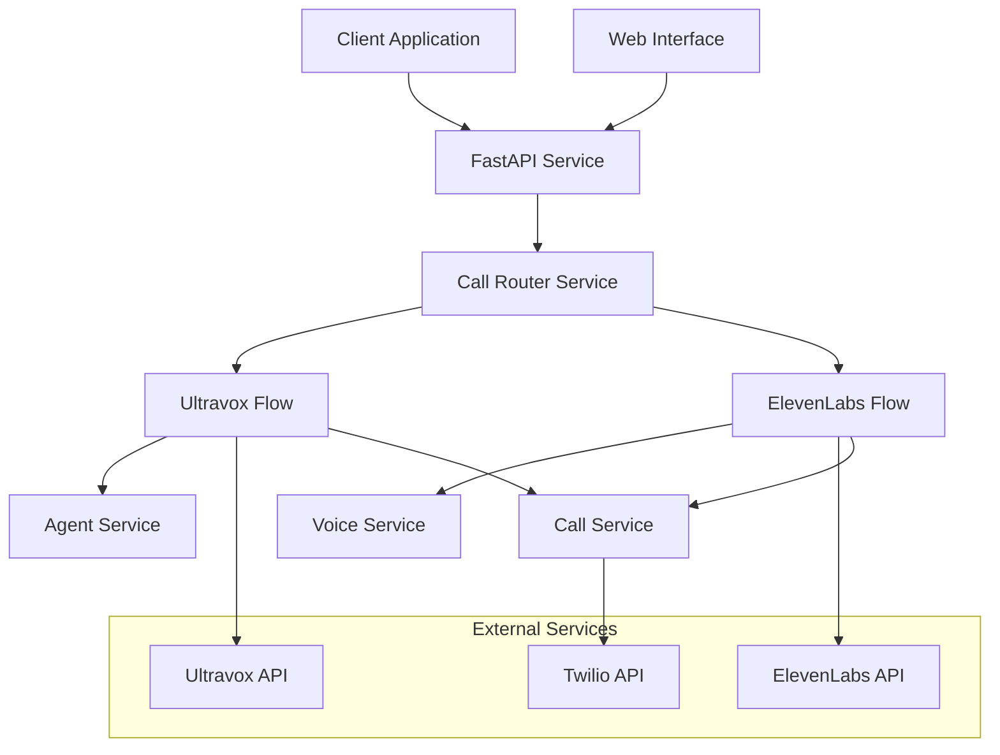
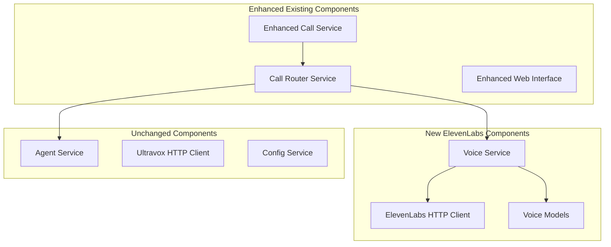

# Design Document - ElevenLabs-Twilio Integration

## Overview

The ElevenLabs-Twilio Integration extends the existing voice call service to support ElevenLabs AI voice synthesis alongside Ultravox AI agents. This design maintains the existing architecture while adding new components for text-to-speech functionality, voice management, and unified call handling.

## Architecture

### High-Level Architecture



### Service Layer Architecture



## Components and Interfaces

### 1. Voice Service (New)

**Purpose:** Manages ElevenLabs voice synthesis operations including voice selection, text-to-speech generation, and voice preview functionality.

**Key Methods:**
```python
class VoiceService:
    async def list_voices() -> List[Voice]
    async def generate_speech(text: str, voice_id: str, settings: VoiceSettings) -> AudioData
    async def preview_voice(voice_id: str, sample_text: str) -> AudioData
    async def validate_text(text: str) -> ValidationResult
```

**Responsibilities:**
- Voice catalog management
- Text-to-speech generation
- Voice preview generation
- Text validation and preprocessing
- Audio format handling

### 2. Call Router Service (New)

**Purpose:** Routes call requests to appropriate service (Ultravox or ElevenLabs) based on call type and manages the unified call creation flow.

**Key Methods:**
```python
class CallRouterService:
    async def route_call(call_request: UnifiedCallRequest) -> CallResult
    async def create_ultravox_call(request: UltravoxCallRequest) -> CallResult
    async def create_elevenlabs_call(request: ElevenLabsCallRequest) -> CallResult
```

**Responsibilities:**
- Call type determination
- Request routing
- Unified response formatting
- Error handling coordination

### 3. Enhanced Call Service (Modified)

**Purpose:** Extended to handle both Ultravox and ElevenLabs call types while maintaining backward compatibility.

**New Methods:**
```python
class CallService:
    # Existing methods remain unchanged
    async def initiate_call(call_request: CallRequest) -> CallResult
    
    # New methods for ElevenLabs support
    async def initiate_elevenlabs_call(request: ElevenLabsCallRequest) -> CallResult
    async def create_tts_call(audio_data: AudioData, phone_number: str) -> CallResult
```

### 4. ElevenLabs HTTP Client (New)

**Purpose:** Handles all HTTP communication with ElevenLabs API including authentication, rate limiting, and error handling.

**Key Methods:**
```python
class ElevenLabsHTTPClient:
    async def get_voices() -> List[Dict]
    async def synthesize_speech(text: str, voice_id: str, settings: Dict) -> bytes
    async def get_voice_settings(voice_id: str) -> Dict
    async def check_quota() -> QuotaInfo
```

## Data Models

### Voice Models (New)

```python
class Voice(BaseModel):
    voice_id: str
    name: str
    category: str
    description: Optional[str]
    preview_url: Optional[str]
    settings: VoiceSettings

class VoiceSettings(BaseModel):
    stability: float = Field(ge=0.0, le=1.0, default=0.75)
    similarity_boost: float = Field(ge=0.0, le=1.0, default=0.75)
    style: float = Field(ge=0.0, le=1.0, default=0.0)
    use_speaker_boost: bool = False

class ElevenLabsCallRequest(BaseModel):
    phone_number: str = Field(..., regex=r'^\+[1-9]\d{1,14}$')
    text: str = Field(..., min_length=1, max_length=5000)
    voice_id: str
    voice_settings: Optional[VoiceSettings] = None
    template_context: Optional[Dict[str, str]] = None

class UnifiedCallRequest(BaseModel):
    call_type: Literal["ultravox", "elevenlabs"]
    phone_number: str
    ultravox_config: Optional[UltravoxCallRequest] = None
    elevenlabs_config: Optional[ElevenLabsCallRequest] = None
```

### Enhanced Call Models (Modified)

```python
class CallResult(BaseModel):
    call_sid: str
    join_url: Optional[str]  # Only for Ultravox calls
    status: str
    created_at: datetime
    call_type: Literal["ultravox", "elevenlabs"]
    metadata: Optional[Dict[str, Any]] = None  # Technology-specific data

class CallHistory(BaseModel):
    calls: List[CallResult]
    total_count: int
    ultravox_count: int
    elevenlabs_count: int
```

## Error Handling

### ElevenLabs-Specific Errors

```python
class ElevenLabsAPIError(Exception):
    def __init__(self, message: str, error_code: Optional[str] = None, quota_exceeded: bool = False):
        self.message = message
        self.error_code = error_code
        self.quota_exceeded = quota_exceeded

class VoiceNotFoundError(ElevenLabsAPIError):
    pass

class TextTooLongError(ValidationError):
    pass

class QuotaExceededError(ElevenLabsAPIError):
    pass
```

### Error Handling Strategy

1. **API Failures:** Graceful degradation - if ElevenLabs is unavailable, disable ElevenLabs features but keep Ultravox working
2. **Quota Limits:** Clear error messages with quota information and suggestions
3. **Voice Errors:** Fallback to default voice if selected voice is unavailable
4. **Text Validation:** Client-side and server-side validation with helpful error messages

## Testing Strategy

### Unit Tests

1. **Voice Service Tests**
   - Voice listing and filtering
   - Text-to-speech generation
   - Voice preview functionality
   - Error handling scenarios

2. **Call Router Tests**
   - Request routing logic
   - Call type determination
   - Error propagation

3. **ElevenLabs Client Tests**
   - API communication
   - Authentication handling
   - Rate limiting behavior

### Integration Tests

1. **End-to-End Call Flow**
   - Complete ElevenLabs call creation
   - Audio generation and delivery
   - Twilio integration

2. **Mixed Environment Tests**
   - Ultravox and ElevenLabs calls in same session
   - Service switching scenarios
   - Configuration validation

3. **Error Scenarios**
   - ElevenLabs API unavailable
   - Quota exceeded scenarios
   - Invalid voice selections

### Performance Tests

1. **Audio Generation Performance**
   - Text-to-speech generation timing
   - Large text handling
   - Concurrent request handling

2. **Memory Usage**
   - Audio data handling
   - Temporary file management
   - Memory cleanup

## Security Considerations

### API Key Management

- ElevenLabs API keys stored in environment variables
- Same security patterns as existing Ultravox integration
- Separate API keys for different environments

### Data Handling

- Text content validation and sanitization
- Audio data temporary storage with automatic cleanup
- No persistent storage of generated audio

### Rate Limiting

- ElevenLabs API rate limiting implementation
- Quota monitoring and alerting
- Fair usage across multiple users

## Configuration

### Environment Variables

```bash
# ElevenLabs Configuration
ELEVENLABS_API_KEY=your_elevenlabs_api_key
ELEVENLABS_BASE_URL=https://api.elevenlabs.io
ELEVENLABS_DEFAULT_VOICE=21m00Tcm4TlvDq8ikWAM

# Feature Flags
ENABLE_ELEVENLABS=true
ELEVENLABS_PREVIEW_ENABLED=true
ELEVENLABS_MAX_TEXT_LENGTH=5000

# Audio Configuration
AUDIO_FORMAT=mp3
AUDIO_QUALITY=high
TEMP_AUDIO_CLEANUP_INTERVAL=3600
```

### Default Settings

- Default voice for new users
- Standard voice settings (stability, similarity)
- Text length limits
- Audio quality settings

## Migration Strategy

### Phase 1: Core Integration
- Add ElevenLabs service components
- Implement basic text-to-speech functionality
- Add configuration and environment setup

### Phase 2: Web Interface Enhancement
- Add ElevenLabs options to web interface
- Implement voice selection and preview
- Add call type selection

### Phase 3: Advanced Features
- Call history with mixed types
- Advanced voice settings
- Monitoring and analytics

### Backward Compatibility

- All existing Ultravox functionality remains unchanged
- Existing API endpoints continue to work
- Configuration is additive (no breaking changes)
- Default behavior remains Ultravox-focused

## Monitoring and Observability

### Metrics

- ElevenLabs API call count and timing
- Character usage and quota consumption
- Voice usage distribution
- Error rates by service type

### Logging

- ElevenLabs API requests and responses
- Audio generation timing and file sizes
- Voice selection patterns
- Error details with context

### Health Checks

- ElevenLabs API connectivity
- Quota status monitoring
- Audio generation capability
- Service availability status