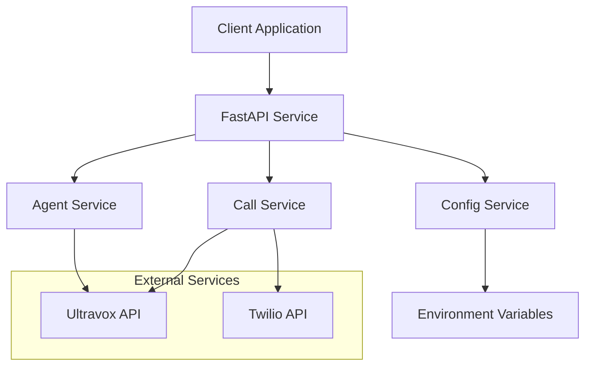
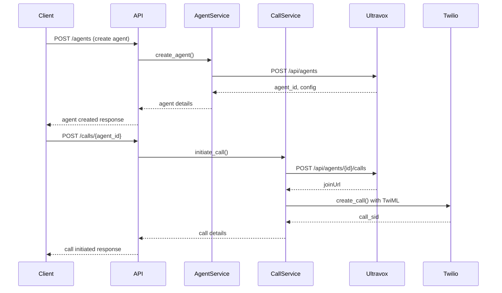

# Design Document

## Overview

The Ultravox-Twilio Integration system is a FastAPI-based service that provides a streamlined interface for creating and managing Ultravox AI agents with Twilio voice integration. The system abstracts the complexity of coordinating between Ultravox's agent API and Twilio's voice services, providing developers with simple REST endpoints to create agents, initiate calls, and manage voice conversations.

The architecture follows a microservice pattern with clear separation of concerns: agent management, call orchestration, and configuration handling. The service acts as a bridge between Ultravox's AI capabilities and Twilio's telecommunications infrastructure.

## Architecture

### System Components



### Request Flow



## Components and Interfaces

### 1. FastAPI Application Layer

**Purpose:** HTTP request handling, routing, and response formatting

**Key Endpoints:**
- `POST /agents` - Create new Ultravox agent
- `GET /agents` - List all agents
- `GET /agents/{agent_id}` - Get agent details
- `PUT /agents/{agent_id}` - Update agent configuration
- `POST /calls/{agent_id}` - Initiate call with specific agent
- `GET /health` - Service health check

### 2. Agent Service

**Purpose:** Manage Ultravox agent lifecycle and configuration

```python
class AgentService:
    async def create_agent(self, config: AgentConfig) -> Agent
    async def get_agent(self, agent_id: str) -> Agent
    async def list_agents(self) -> List[Agent]
    async def update_agent(self, agent_id: str, config: AgentConfig) -> Agent
    async def delete_agent(self, agent_id: str) -> bool
```

### 3. Call Service

**Purpose:** Orchestrate calls between Ultravox and Twilio

```python
class CallService:
    async def initiate_call(self, agent_id: str, phone_number: str, context: dict) -> CallResult
    async def get_join_url(self, agent_id: str, context: dict) -> str
    async def create_twilio_call(self, join_url: str, phone_number: str) -> TwilioCallResult
```

### 4. Configuration Service

**Purpose:** Manage environment variables and service configuration

```python
class ConfigService:
    def get_ultravox_config(self) -> UltravoxConfig
    def get_twilio_config(self) -> TwilioConfig
    def validate_configuration(self) -> bool
```

### 5. HTTP Client Service

**Purpose:** Handle external API communications with proper error handling and retries

```python
class HTTPClientService:
    async def make_ultravox_request(self, method: str, endpoint: str, data: dict) -> dict
    async def handle_api_errors(self, response: aiohttp.ClientResponse) -> dict
```

## Data Models

### Agent Configuration Model

```python
class AgentConfig(BaseModel):
    name: str
    prompt: str
    voice: Optional[str] = "default"
    language: Optional[str] = "en"
    template_variables: Optional[Dict[str, str]] = {}
    
class Agent(BaseModel):
    id: str
    config: AgentConfig
    created_at: datetime
    updated_at: datetime
    status: AgentStatus
```

### Call Models

```python
class CallRequest(BaseModel):
    phone_number: str
    template_context: Dict[str, Any]
    agent_id: str
    
class CallResult(BaseModel):
    call_sid: str
    join_url: str
    status: CallStatus
    created_at: datetime
    
class TwilioCallResult(BaseModel):
    sid: str
    status: str
    from_number: str
    to_number: str
```

### Configuration Models

```python
class UltravoxConfig(BaseModel):
    api_key: str
    base_url: str = "https://api.ultravox.ai"
    
class TwilioConfig(BaseModel):
    account_sid: str
    auth_token: str
    phone_number: str
```

## Error Handling

### Error Categories

1. **Configuration Errors** - Missing or invalid environment variables
2. **Validation Errors** - Invalid request payloads or parameters
3. **External API Errors** - Ultravox or Twilio API failures
4. **Network Errors** - Connection timeouts or network issues
5. **Business Logic Errors** - Invalid state transitions or operations

### Error Response Format

```python
class ErrorResponse(BaseModel):
    error: str
    message: str
    details: Optional[Dict[str, Any]] = None
    timestamp: datetime
    request_id: str
```

### Error Handling Strategy

- **Retry Logic:** Implement exponential backoff for transient failures
- **Circuit Breaker:** Prevent cascading failures when external services are down
- **Graceful Degradation:** Provide meaningful error messages to clients
- **Logging:** Comprehensive error logging with correlation IDs

## Testing Strategy

### Unit Testing

- **Service Layer Tests:** Mock external dependencies, test business logic
- **Model Validation Tests:** Verify Pydantic model validation rules
- **Configuration Tests:** Test environment variable loading and validation
- **Error Handling Tests:** Verify proper error responses and logging

### Integration Testing

- **API Endpoint Tests:** Test complete request/response cycles
- **External Service Integration:** Test actual API calls with test credentials
- **End-to-End Scenarios:** Test complete call flow from agent creation to call completion

### Test Structure

```
tests/
├── unit/
│   ├── test_agent_service.py
│   ├── test_call_service.py
│   ├── test_config_service.py
│   └── test_models.py
├── integration/
│   ├── test_api_endpoints.py
│   ├── test_ultravox_integration.py
│   └── test_twilio_integration.py
└── e2e/
    └── test_complete_call_flow.py
```

### Testing Tools

- **pytest** - Test framework
- **pytest-asyncio** - Async test support
- **httpx** - HTTP client for API testing
- **pytest-mock** - Mocking framework
- **factory-boy** - Test data generation