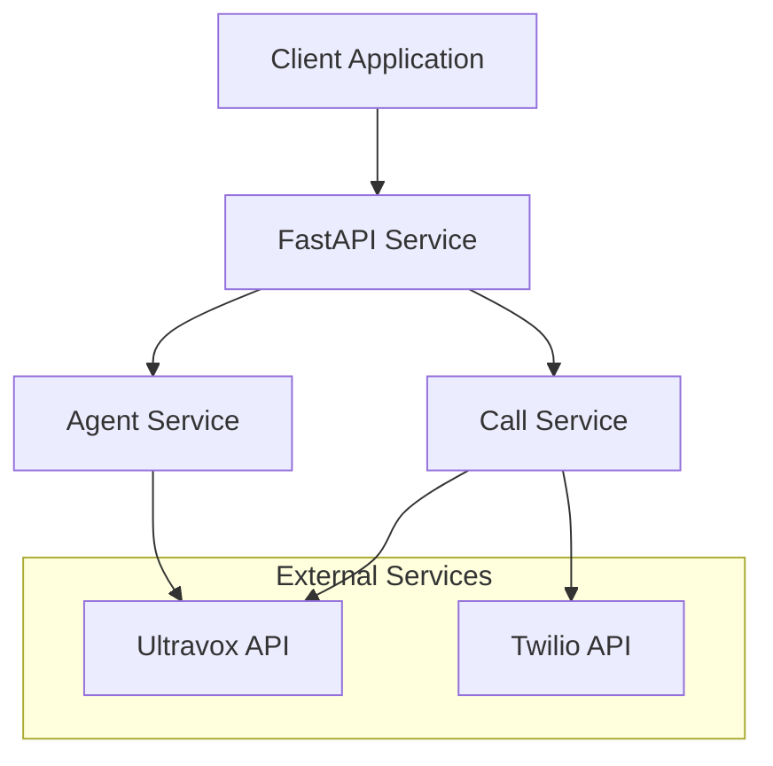

# Ultravox-Twilio Integration Service

[](https://www.python.org/downloads/)
[](https://fastapi.tiangolo.com/)
[](https://opensource.org/licenses/MIT)

A production-ready FastAPI service that seamlessly integrates Ultravox AI agents with Twilio voice calls, enabling developers to create sophisticated AI-powered voice assistants with minimal setup.

## 🚀 Features

- **🤖 AI Agent Management**: Create, update, and manage Ultravox AI agents programmatically
- **📞 Voice Call Integration**: Initiate phone calls that connect users directly to AI agents
- **🔧 Dynamic Templates**: Inject context variables for personalized conversations
- **🛡️ Enterprise Security**: API key authentication, rate limiting, and input validation
- **📊 Monitoring & Metrics**: Comprehensive health checks, logging, and performance metrics
- **🔄 Production Ready**: Docker support, horizontal scaling, and robust error handling
- **📚 Complete Documentation**: Interactive API docs, examples, and deployment guides

## 🏗️ Architecture



## 🚀 Quick Start

### Prerequisites

- Python 3.8+
- [Ultravox API account](https://ultravox.ai) and API key
- [Twilio account](https://twilio.com) with voice capabilities

### 1. Installation

```bash
# Clone the repository
git clone <repository-url>
cd ultravox-twilio-integration

# Create virtual environment
python -m venv .venv
source .venv/bin/activate  # On Windows: .venv\Scripts\activate

# Install dependencies
pip install -r requirements.txt
```

### 2. Configuration

```bash
# Copy environment template
cp .env.example .env

# Edit .env with your credentials
export ULTRAVOX_API_KEY="your-ultravox-api-key"
export TWILIO_ACCOUNT_SID="ACxxxxxxxxxxxxxxxxxxxxxxxxxxxxxxxx"
export TWILIO_AUTH_TOKEN="your-twilio-auth-token"
export TWILIO_PHONE_NUMBER="+1234567890"
export API_KEY="your-service-api-key"
```

### 3. Run the Service

```bash
# Development server with hot reload
python scripts/dev.py

# Or production server
python -m uvicorn app.main:app --host 0.0.0.0 --port 8000
```

### 4. Verify Installation

```bash
# Check service health
curl http://localhost:8000/api/v1/health

# Access interactive documentation
open http://localhost:8000/docs
```

## 📖 API Usage

### Create an AI Agent

```bash
curl -X POST "http://localhost:8000/api/v1/agents" \
  -H "Content-Type: application/json" \
  -H "X-API-Key: your-api-key" \
  -d '{
    "name": "Customer Support Agent",
    "prompt": "You are a helpful customer support agent for {{company_name}}. Assist customers with their inquiries professionally.",
    "voice": "default",
    "language": "en",
    "template_variables": {
      "company_name": "Acme Corp",
      "support_hours": "9 AM - 5 PM EST"
    }
  }'
```

**Response:**
```json
{
  "id": "agent_cs_001",
  "config": {
    "name": "Customer Support Agent",
    "prompt": "You are a helpful customer support agent for {{company_name}}...",
    "voice": "default",
    "language": "en",
    "template_variables": {
      "company_name": "Acme Corp",
      "support_hours": "9 AM - 5 PM EST"
    }
  },
  "created_at": "2024-01-01T12:00:00Z",
  "updated_at": "2024-01-01T12:00:00Z",
  "status": "active"
}
```

### Initiate a Voice Call

```bash
curl -X POST "http://localhost:8000/api/v1/calls/agent_cs_001" \
  -H "Content-Type: application/json" \
  -H "X-API-Key: your-api-key" \
  -d '{
    "phone_number": "+1234567890",
    "template_context": {
      "customer_name": "John Smith",
      "account_type": "Premium",
      "issue_category": "billing"
    },
    "agent_id": "agent_cs_001"
  }'
```

**Response:**
```json
{
  "call_sid": "CA1234567890abcdef1234567890abcdef",
  "join_url": "wss://api.ultravox.ai/calls/call_789/join",
  "status": "initiated",
  "created_at": "2024-01-01T12:00:00Z",
  "agent_id": "agent_cs_001",
  "phone_number": "+1234567890"
}
```

## 📚 Documentation

| Document | Description |
|----------|-------------|
| [📋 API Reference](docs/api.md) | Complete API documentation with all endpoints |
| [💡 Usage Examples](docs/examples.md) | Practical examples and code samples |
| [🚀 Deployment Guide](docs/deployment.md) | Production deployment and configuration |
| [🔧 Troubleshooting](docs/troubleshooting.md) | Common issues and solutions |
| [🔒 Security Guide](docs/security.md) | Security best practices and configuration |

## 🐳 Docker Deployment

### Quick Start with Docker

```bash
# Build the image
docker build -t ultravox-twilio-service .

# Run the container
docker run -d \
  --name ultravox-twilio \
  -p 8000:8000 \
  --env-file .env \
  ultravox-twilio-service
```

### Docker Compose

```yaml
version: '3.8'
services:
  ultravox-twilio:
    build: .
    ports:
      - "8000:8000"
    environment:
      - ULTRAVOX_API_KEY=${ULTRAVOX_API_KEY}
      - TWILIO_ACCOUNT_SID=${TWILIO_ACCOUNT_SID}
      - TWILIO_AUTH_TOKEN=${TWILIO_AUTH_TOKEN}
      - TWILIO_PHONE_NUMBER=${TWILIO_PHONE_NUMBER}
      - API_KEY=${API_KEY}
    restart: unless-stopped
    healthcheck:
      test: ["CMD", "curl", "-f", "http://localhost:8000/api/v1/health"]
      interval: 30s
      timeout: 10s
      retries: 3
```

```bash
docker-compose up -d
```

## 🧪 Development

For detailed development setup instructions, see the [Development Guide](docs/development.md).

### Quick Development Setup

```bash
# Install dependencies
make install

# Start development server with hot reload
make dev

# Run tests
make test

# Format and lint code
make format
make lint
```

### Development Commands

| Command | Description |
|---------|-------------|
| `make dev` | Start development server with hot reload |
| `make test` | Run all tests |
| `make test-cov` | Run tests with coverage report |
| `make lint` | Run code linting |
| `make format` | Format code with black and isort |
| `make validate-config` | Validate environment configuration |
| `make docker-dev` | Start development environment with Docker |

### Environment-Specific Development

```bash
# Development environment (default)
make dev

# Staging environment
make dev-staging

# Custom environment
python scripts/dev.py --env custom --port 8080
```

See [Development Guide](docs/development.md) for complete setup instructions, debugging tips, and contribution guidelines.

## 🔧 Configuration

### Environment Variables

| Variable | Required | Description | Example |
|----------|----------|-------------|---------|
| `ULTRAVOX_API_KEY` | ✅ | Ultravox API authentication key | `sk-1234567890abcdef` |
| `TWILIO_ACCOUNT_SID` | ✅ | Twilio Account SID | `ACxxxxxxxxxxxxxxxxxxxxxxxxxxxxxxxx` |
| `TWILIO_AUTH_TOKEN` | ✅ | Twilio authentication token | `your_auth_token_here` |
| `TWILIO_PHONE_NUMBER` | ✅ | Twilio phone number for calls | `+1234567890` |
| `API_KEY` | ✅ | Service API key for authentication | `your_service_api_key` |
| `DEBUG` | ❌ | Enable debug mode | `false` |
| `LOG_LEVEL` | ❌ | Logging level | `INFO` |
| `WORKERS` | ❌ | Number of worker processes | `1` |

See [Configuration Guide](docs/deployment.md#environment-variables-reference) for complete list.

## 📊 Monitoring

### Health Checks

```bash
# Basic health check
curl http://localhost:8000/api/v1/health

# Detailed health check with external service connectivity
curl http://localhost:8000/api/v1/health/detailed
```

### Metrics

```bash
# Application metrics
curl -H "X-API-Key: your-api-key" http://localhost:8000/api/v1/metrics

# Recent events
curl -H "X-API-Key: your-api-key" http://localhost:8000/api/v1/metrics/events

# API call metrics
curl -H "X-API-Key: your-api-key" http://localhost:8000/api/v1/metrics/api-calls
```

## 🔒 Security Features

- **API Key Authentication**: Secure access control for all endpoints
- **Rate Limiting**: Protection against abuse and DoS attacks
- **Input Validation**: Comprehensive request validation and sanitization
- **Security Headers**: CORS, HSTS, and other security headers
- **Audit Logging**: Complete request/response logging with correlation IDs

## 🚀 Production Deployment

### Systemd Service

```bash
# Install as system service
sudo cp deploy/ultravox-twilio.service /etc/systemd/system/
sudo systemctl enable ultravox-twilio
sudo systemctl start ultravox-twilio
```

### Kubernetes

```bash
# Deploy to Kubernetes
kubectl apply -f deploy/k8s/
```

### Load Balancing

The service is stateless and supports horizontal scaling:

```nginx
upstream ultravox_twilio {
    server 127.0.0.1:8000;
    server 127.0.0.1:8001;
    server 127.0.0.1:8002;
}
```

## 🤝 Contributing

1. Fork the repository
2. Create a feature branch (`git checkout -b feature/amazing-feature`)
3. Commit your changes (`git commit -m 'Add amazing feature'`)
4. Push to the branch (`git push origin feature/amazing-feature`)
5. Open a Pull Request

### Development Setup

```bash
# Install development dependencies
pip install -r dev-requirements.txt

# Install pre-commit hooks
pre-commit install

# Run tests before committing
pytest
```

## 📝 API Examples

### Python SDK

```python
import requests

class UltravoxTwilioClient:
    def __init__(self, base_url: str, api_key: str):
        self.base_url = base_url.rstrip('/')
        self.headers = {
            'Content-Type': 'application/json',
            'X-API-Key': api_key
        }
    
    def create_agent(self, name: str, prompt: str, **kwargs):
        data = {'name': name, 'prompt': prompt, **kwargs}
        response = requests.post(f'{self.base_url}/agents', json=data, headers=self.headers)
        return response.json()
    
    def initiate_call(self, agent_id: str, phone_number: str, context: dict = None):
        data = {
            'phone_number': phone_number,
            'template_context': context or {},
            'agent_id': agent_id
        }
        response = requests.post(f'{self.base_url}/calls/{agent_id}', json=data, headers=self.headers)
        return response.json()

# Usage
client = UltravoxTwilioClient('http://localhost:8000/api/v1', 'your-api-key')
agent = client.create_agent('Support Bot', 'You are a helpful assistant.')
call = client.initiate_call(agent['id'], '+1234567890', {'customer': 'John'})
```

### JavaScript/Node.js

```javascript
class UltravoxTwilioClient {
    constructor(baseUrl, apiKey) {
        this.baseUrl = baseUrl.replace(/\/$/, '');
        this.headers = {
            'Content-Type': 'application/json',
            'X-API-Key': apiKey
        };
    }

    async createAgent(config) {
        const response = await fetch(`${this.baseUrl}/agents`, {
            method: 'POST',
            headers: this.headers,
            body: JSON.stringify(config)
        });
        return response.json();
    }

    async initiateCall(agentId, phoneNumber, templateContext = {}) {
        const response = await fetch(`${this.baseUrl}/calls/${agentId}`, {
            method: 'POST',
            headers: this.headers,
            body: JSON.stringify({
                phone_number: phoneNumber,
                template_context: templateContext,
                agent_id: agentId
            })
        });
        return response.json();
    }
}
```

## 🐛 Troubleshooting

### Common Issues

**Service won't start:**
```bash
# Check configuration
python -c "from app.services.config_service import ConfigService; ConfigService().load_configuration()"

# Check logs
tail -f /var/log/ultravox-twilio.log
```

**Call initiation fails:**
```bash
# Verify phone number format
curl -X POST "http://localhost:8000/api/v1/calls/agent_id" \
  -H "X-API-Key: your-api-key" \
  -d '{"phone_number": "+1234567890", "agent_id": "agent_id"}'
```

See [Troubleshooting Guide](docs/troubleshooting.md) for detailed solutions.

## 📄 License

This project is licensed under the MIT License - see the [LICENSE](LICENSE) file for details.

## 🙏 Acknowledgments

- [FastAPI](https://fastapi.tiangolo.com/) for the excellent web framework
- [Ultravox](https://ultravox.ai) for AI agent capabilities
- [Twilio](https://twilio.com) for voice communication services

## 📞 Support

- **Documentation**: [Complete API docs](docs/api.md)
- **Issues**: [GitHub Issues](https://github.com/your-org/ultravox-twilio-integration/issues)
- **Discussions**: [GitHub Discussions](https://github.com/your-org/ultravox-twilio-integration/discussions)

---

**Ready to build AI-powered voice applications?** Start with our [Quick Start Guide](#-quick-start) or explore the [API Documentation](docs/api.md)!