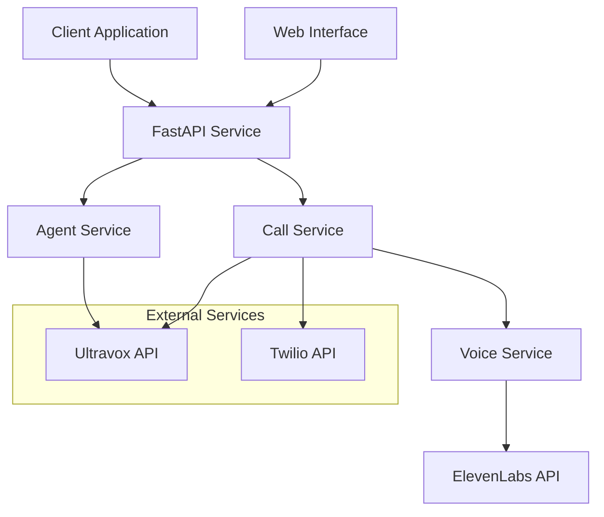

# 🤖📞 Ultravox-Twilio Integration Service

[](https://www.python.org/downloads/)
[](https://fastapi.tiangolo.com/)
[](https://opensource.org/licenses/MIT)

A production-ready FastAPI service that seamlessly integrates Ultravox AI agents and ElevenLabs voice synthesis with Twilio voice calls, enabling developers to create sophisticated AI-powered voice assistants and high-quality voice messages with minimal setup.

## ✨ Features

- **🤖 AI Agent Management**: Create, update, and manage Ultravox AI agents with custom prompts
- **🎤 Voice Message Synthesis**: Generate high-quality voice messages using ElevenLabs text-to-speech
- **📞 Dual Call Integration**: Choose between interactive AI conversations (Ultravox) or voice messages (ElevenLabs)
- **🌐 Enhanced Web Interface**: User-friendly interface with service selection, voice previews, and real-time feedback
- **🔧 Dynamic Templates**: Inject context variables for personalized conversations
- **🛡️ Enterprise Security**: API key authentication, rate limiting, input validation, and secure credential handling
- **📊 Monitoring & Metrics**: Comprehensive health checks, logging, performance metrics, and error tracking
- **🔄 Production Ready**: Docker support, horizontal scaling, robust error handling, and deployment guides
- **📚 Complete Documentation**: Interactive API docs, setup guides, and troubleshooting resources

## 🏗️ Architecture



## 🚀 Quick Start

### Prerequisites

- Python 3.8+
- [Ultravox API account](https://dashboard.ultravox.ai) and API key
- [Twilio account](https://console.twilio.com) with phone number and credentials
- [ElevenLabs API account](https://elevenlabs.io) and API key (optional, for voice synthesis)

### 1. Installation

```bash
# Clone the repository
git clone <your-repository-url>
cd ultravox-twilio-integration

# Create virtual environment
python -m venv .venv
source .venv/bin/activate  # On Windows: .venv\Scripts\activate

# Install dependencies
pip install -r requirements.txt
```

### 2. Configuration

```bash
# Copy environment template
cp .env.example .env

# Edit .env with your actual credentials
# NEVER commit the .env file to version control
```

Required environment variables:
```bash
# Ultravox Configuration
ULTRAVOX_API_KEY=your_ultravox_api_key_here
ULTRAVOX_BASE_URL=https://api.ultravox.ai

# Twilio Configuration  
TWILIO_ACCOUNT_SID=your_twilio_account_sid_here
TWILIO_AUTH_TOKEN=your_twilio_auth_token_here
TWILIO_PHONE_NUMBER=+1234567890
TWILIO_USER_SID=your_twilio_user_sid_here

# ElevenLabs Configuration (Optional)
ELEVENLABS_API_KEY=your_elevenlabs_api_key_here
ELEVENLABS_BASE_URL=https://api.elevenlabs.io/v1
ELEVENLABS_MAX_TEXT_LENGTH=5000

# Application Configuration
DEBUG=false
LOG_LEVEL=INFO
PORT=8000
API_KEY=your_secure_api_key_here
```

### 3. Validate Setup

```bash
# Check configuration
python scripts/validate-config.py

# Run tests
pytest tests/
```

### 4. Run the Service

```bash
# Option 1: Full production service
python app/main.py

# Option 2: Simple web interface (development)
python simple-web-server-secure.py
```

Access the service:
- **API**: http://localhost:8000
- **Web Interface**: http://localhost:8000 (or :8001 for simple server)
- **API Docs**: http://localhost:8000/docs

## 🔑 Getting Your API Keys

### Ultravox API Key
1. Visit [Ultravox Dashboard](https://dashboard.ultravox.ai)
2. Navigate to API Keys section
3. Create a new API key
4. Copy to your `.env` file

### Twilio Credentials
1. Visit [Twilio Console](https://console.twilio.com)
2. Find Account SID and Auth Token on dashboard
3. Purchase a phone number if needed
4. Copy all credentials to `.env` file

## 🌐 Using the Web Interface

1. **Open your browser** to the service URL
2. **Create an AI Agent**:
   - Enter agent name (letters, numbers, hyphens, underscores only - no spaces)
   - Write agent instructions/prompt
   - Click "Create Agent"

3. **Make a Voice Call**:
   - Select an agent from the list
   - Enter phone number in international format (+1234567890)
   - Click "Make Call"

### Agent Name Rules
- ✅ `Customer-Service-Bot`
- ✅ `Support_Agent_v2`
- ✅ `AI-Assistant-123`
- ❌ `Customer Service Bot` (no spaces)
- ❌ `Agent@Company` (no special characters)

## 📞 API Usage

### Create an Agent
```bash
curl -X POST "http://localhost:8000/api/v1/agents" \
  -H "X-API-Key: your-api-key" \
  -H "Content-Type: application/json" \
  -d '{
    "name": "Customer-Support-Agent",
    "prompt": "You are a helpful customer support agent.",
    "voice": "9dc1c0e9-db7c-46a5-a610-b04e7ebf37ee"
  }'
```

### Make a Call
```bash
curl -X POST "http://localhost:8000/api/v1/calls/{agent_id}" \
  -H "X-API-Key: your-api-key" \
  -H "Content-Type: application/json" \
  -d '{
    "phone_number": "+1234567890",
    "template_context": {}
  }'
```

## 🧪 Testing

```bash
# Run all tests
pytest

# Run with coverage
pytest --cov=app tests/

# Run integration tests only
pytest tests/integration/

# Run specific test file
pytest tests/test_agent_service.py
```

## 🚀 Deployment

### Docker
```bash
# Build image
docker build -t ultravox-twilio-service .

# Run container
docker run -p 8000:8000 --env-file .env ultravox-twilio-service
```

### Production Deployment
See [docs/deployment.md](docs/deployment.md) for detailed deployment instructions including:
- Environment setup
- Database configuration
- Load balancing
- Monitoring setup

## 📚 Documentation

- **[Setup Guide](SETUP.md)** - Detailed setup instructions for your team
- **[API Documentation](docs/api.md)** - Complete API reference
- **[Development Guide](docs/development.md)** - Development workflow and guidelines
- **[Security Guide](docs/security.md)** - Security best practices
- **[Troubleshooting](docs/troubleshooting.md)** - Common issues and solutions

## 🔒 Security

- **Environment Variables**: All sensitive data is stored in environment variables
- **API Key Authentication**: Secure API access with configurable keys
- **Input Validation**: Comprehensive request validation and sanitization
- **Rate Limiting**: Protection against abuse and DoS attacks
- **Secure Defaults**: Production-ready security configuration

**⚠️ Important**: Never commit `.env` files or hardcode API keys in your code!

## 🤝 Contributing

1. Fork the repository
2. Create a feature branch (`git checkout -b feature/amazing-feature`)
3. Make your changes
4. Add tests for new functionality
5. Ensure all tests pass (`pytest`)
6. Commit your changes (`git commit -m 'Add amazing feature'`)
7. Push to the branch (`git push origin feature/amazing-feature`)
8. Open a Pull Request

## 📄 License

This project is licensed under the MIT License - see the [LICENSE](LICENSE) file for details.

## 🆘 Support

- **Issues**: [GitHub Issues](https://github.com/your-username/ultravox-twilio-integration/issues)
- **Documentation**: Check the `docs/` directory
- **Troubleshooting**: See [docs/troubleshooting.md](docs/troubleshooting.md)

## 🙏 Acknowledgments

- [Ultravox](https://ultravox.ai) for the AI voice platform
- [Twilio](https://twilio.com) for the voice communication infrastructure
- [FastAPI](https://fastapi.tiangolo.com) for the web framework